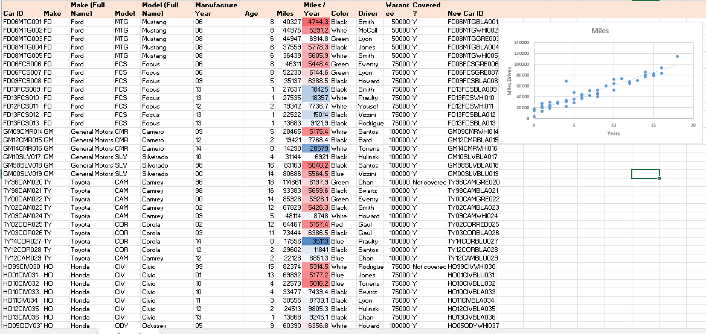
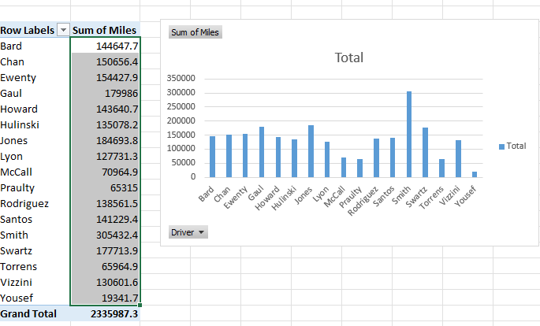
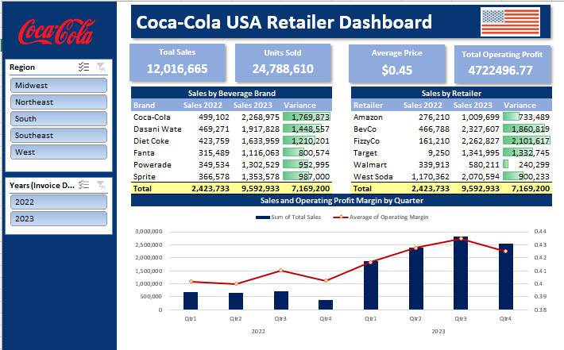
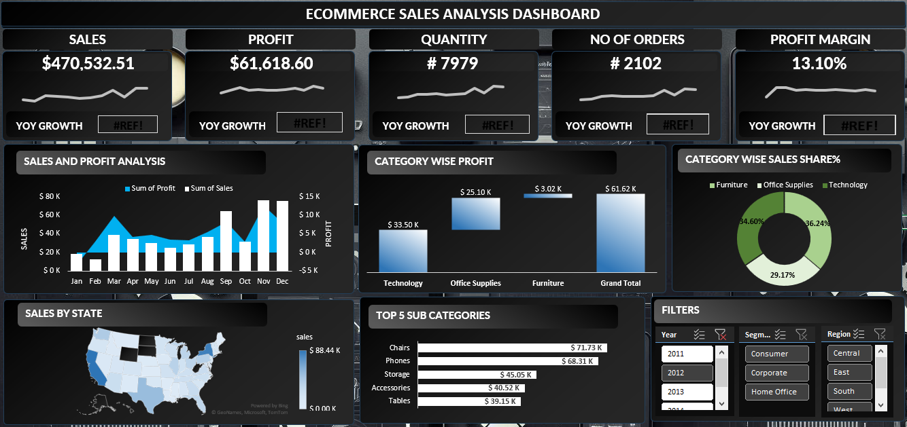
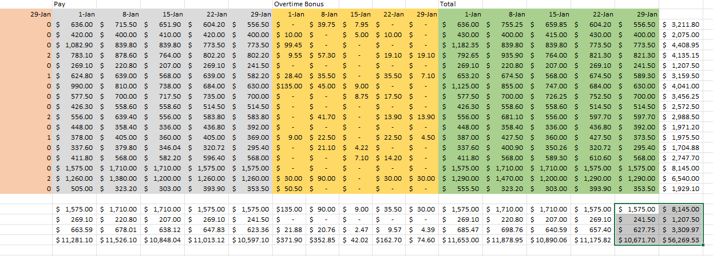

# Data Science & AI Portfolio

**Bioinformatics Researcher → Data Science & AI**

15+ years in Bioinformatics and Academia, now building end-to-end data solutions across Excel, Python, SQL, and BI tools. This portfolio demonstrates my transition from theoretical research to practical, business-impact-driven analytics.

---

## 📊 Excel Dashboard Previews

### Car Inventory Dashboard

### Car Inventory Dashboard

### Coca-Cola Retailer Analysis

### Ecommerce Sales Analysis

### Payroll & Bonus Analysis

---

## Featured Projects

### Excel Dashboards & Analysis
| Project | What It Shows | Skills |
|---------|---------------|--------|
| [Adidas US Sales Dashboard](Excel%20Projects/Adidas%20US%20sales%20dataset) | Sales performance, regional trends, product analytics | PivotTables, Charts, Slicers |
| [Coca-Cola Retailer Analysis](Excel%20Projects/Cocacola%20Retailer%20Analysis) | Retail distribution, inventory, sales patterns | Data modeling, VLOOKUP/INDEX-MATCH, Conditional Formatting |
| [Ecommerce Sales Analysis](Excel%20Projects/Ecommerce%20Sales%20Analysis) | Customer behavior, revenue trends, KPI tracking | Dashboard design, What-if analysis, Macros-ready structure |
| [Basic Excel Projects](Basic_Excel_Projects) | 10 foundational projects (payroll, inventory, expenses, gradebook, etc.) | Formulas, financial modeling, data validation |

### Other Tools
- **Python** — Machine Learning models, automation scripts, data cleaning
- **SQL** — Database querying and data extraction
- **Tableau / Power BI / Looker Studio** — Interactive dashboards and executive reporting
- **R** — Statistical analysis and bioinformatics pipelines

---

## Tech Stack
`Python` · `R` · `SQL` · `Excel` · `Tableau` · `Power BI` · `Looker Studio` · `Machine Learning` · `Bioinformatics`

---

## What I Bring
- Domain expertise in **life sciences data** (genomics, clinical research)
- Strong **statistical foundation** from 15 years in academia
- **Business translation**: converting raw data into decisions that matter
- Self-driven upskilling in modern data stack (Google Data Analytics certified)

---
## 🌐 Live Projects & Demos

| Project | What It Does | Link |
|---------|--------------|------|
| **CellScribe** | [Single-cell RNA-seq analysis / cell annotation tool] | [cellscribe.ayushnexa.com](https://cellscribe.ayushnexa.com) |
| **PathoWatch** | [Pathogen surveillance / infectious disease monitoring] | [pathowatch.ayushnexa.com](https://pathowatch.ayushnexa.com) |
| **SeqLens** | [Genomic sequence analysis / variant interpretation] | [seqlens.ayushnexa.com](https://seqlens.ayushnexa.com) |
| **OmniGen** | [Multi-omics data integration / general genomics platform] | [omnigen.ayushnexa.com](https://omnigen.ayushnexa.com) |

---

## Tech Stack
`Python` · `R` · `SQL` · `Excel` · `Tableau` · `Power BI` · `Looker Studio` · `Machine Learning` · `Bioinformatics`

---

## What I Bring
- Domain expertise in **life sciences data** (genomics, clinical research)
- Strong **statistical foundation** from 15 years in academia
- **Business translation**: converting raw data into decisions that matter
- Self-driven upskilling in modern data stack (Google Data Analytics certified)

---

**Connect:** [LinkedIn](https://www.linkedin.com/in/akumar-ayushnexa/) · [Portfolio Website](https://ayushnexa.com/) · [Email](kavibioinfo@gmail.com)

_Developed by Avinash Kumar | AyushNexa_
